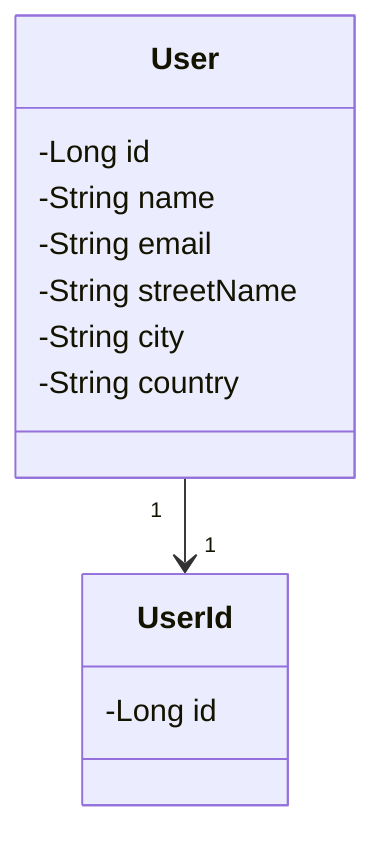

# QSplitter

A simple tool to help developers implement strategies to work around [ORA-01795](https://docs.oracle.com/en/error-help/db/ora-01795/index.html?r=23ai) and [ORA-00913](https://docs.oracle.com/en/error-help/db/ora-00913/?r=23ai) errors.

## Usage

Add this dependency to the `pom.xml`:

```xml
<dependency>
    <groupId>io.github.tnas</groupId>
    <artifactId>qsplitter</artifactId>
    <version>1.0.0</version>
</dependency>
```
## Class Diagram

To describe how to use the implemented strategies, assume the following classes
presented in the diagram below.


All strategies were implemented for JPA Criteria API. The next sections describe how to use
the lib in the Java code.

## N Queries Strategy

```java
// Objects the must be supplied by the application
EntityManager em;
List<Long> ids;
CriteriaQuery<User> query;

var qSplitterDao = new NQueriesDao<User, Long>(em);
var entities = this.qSplitterDao.select(ids, query, User_.id);

assertEquals(503, entities.size());
```

## Disjunctions of Expression Lists

```java
static final int TOTAL_RECORDS = 99765;

// Objects the must be supplied by the application
EntityManager em; 
List<Long> ids; 
CriteriaQuery<User> query;

var qSplitterDao = new DisjunctionsDao<User, Long>(em);
var entities = this.qSplitterDao.select(ids, query, User_.id);

assertEquals(503,entities.size());
```

## Temporary Table

```java
// Objects the must be supplied by the application
EntityManager em;
List<Long> ids;
CriteriaQuery<User> query;

var qSplitterDao = new TempTableDao<User, Long>(em);
var tempRelation = new TableRelationship<User, Long, UserId>(UserId.class, Long.class, User_.replicatedId);
var entities = this.qSplitterDao.select(ids, query, tempRelation);

assertEquals(503,entities.size());
```

## References

Access the DZone article to learn more details about the tool: [Workarounds for Oracle Restrictions on the Size of Expression Lists](https://dzone.com/articles/workarounds-for-oracle-restrictions)